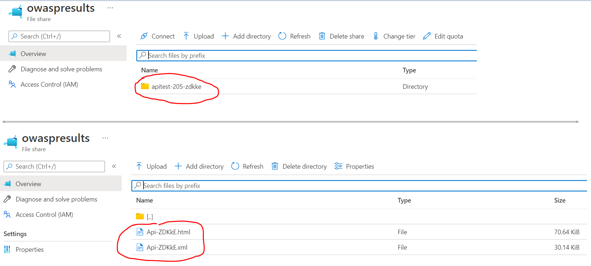
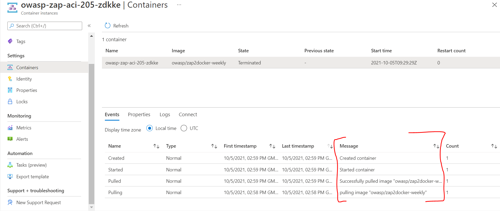
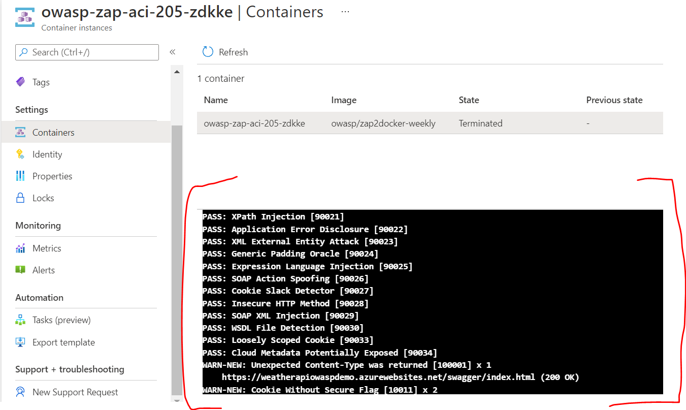

- [1. Description](#1-description)
- [2. Tasks](#2-tasks)
  - [2.1. Create Release Notes](#21-create-release-notes)
    - [2.1.1. More Information](#211-more-information)
  - [2.2. Azure Devops Extension - capgemini-uk-msft-owaspscan-extensions](#22-azure-devops-extension---capgemini-uk-msft-owaspscan-extensions)
    - [2.2.1. Usage:](#221-usage)
      - [2.2.1.1. Install the below extension in your azure devops organization:](#2211-install-the-below-extension-in-your-azure-devops-organization)
      - [2.2.1.2. Dependencies:](#2212-dependencies)
      - [2.2.1.3. Use the extension as a pipeline task in your azure devops yaml pipeline to run Security Scan on API's:](#2213-use-the-extension-as-a-pipeline-task-in-your-azure-devops-yaml-pipeline-to-run-security-scan-on-apis)
      - [2.2.1.4. Output:](#2214-output)
- [3. How this Extension works:](#3-how-this-extension-works)
- [4. More Information:](#4-more-information)
## 1. Description

Azure.DevOps.Extension.Xrm.Release provides tasks for use in Azure DevOps release pipelines. These tasks enable a Continuous Deployment pipeline to be created for Dynamics 365.

## 2. Tasks

### 2.1. Create Release Notes

Creates a release note page for each release to a specific environment. You must provide a wiki structure that matches the WikiPath property in the task.

Please remember to give the build agent service contributor permissions to the Wiki. On installation you must provide the organisation name as a parameter to


#### 2.1.1. More Information

More information can be found in our [GitHub Wiki](https://github.com/Capgemini/msft-release-extensions/wiki).

----

### 2.2. Azure Devops Extension - capgemini-uk-msft-owaspscan-extensions

OWASP Zed Attack Proxy (ZAP) is an open source security tool used in the industry for performing security scan on web applications and APIs. Doing Security scan on a application helps ensure that there are no security vulnerabilities hackers could exploit and development team will be able to identify security loopholes in the system before it goes to production.

This extension provides OWASP Scan tasks for use in Azure DevOps release pipelines. This task enable easily scan APIs and publish report to pipeline in Test tab.

#### 2.2.1. Usage:

##### 2.2.1.1. Install the below extension in your azure devops organization:

https://marketplace.visualstudio.com/items?itemName=capgemini-msft-uk.build-release-task

##### 2.2.1.2. Dependencies:
- Azure Storage account and File Share - Storage account with File share is required. Once scan is finished OWASP xml and html report is being stored inside file share. This extension supports using storage account which is in private network.
- Azure container instance (ACI) - This extension uses Azure Container Instance(ACI) to run OWASP Zap image (**zap-api-scan.py**). So it will create ACI on the fly to scan the apis. Once scan is finished and reports is published, it will automatically delete ACI. Make sure appropriate permissions are in place so that extension can create and delete ACI.
- options.prop file - This file is the list of request header paraemters to API which OWASP requires for scanning. You will need to provide this file while using this extension. Go to https://github.com/Capgemini/msft-release-extensions for more details.

##### 2.2.1.3. Use the extension as a pipeline task in your azure devops yaml pipeline to run Security Scan on API's:
You will also need to use **PublishTestResults@2** task with this extension in order to publish test result after scan is completed. below is the example which shows how to use it in YAML pipeline.

```
- task: capgemini-uk-msft-owaspscan-extensions@0
      inputs:
        azureSubscription: '{subscription}'
        ResourceGroupName: 'owasp-demos-rg'
        Location: 'UK South'
        VNet: 'aci-vnet'
        Subnet: 'aci-subnet'
        ApiEndpoint: 'https://{api base url}/swagger/v1/swagger.json'
        StorageAccountName: '{storage account name}'
        ShareName: 'owaspresults'
        ImageName: 'owasp/zap2docker-weekly'
        OptionFilePath: '$(System.ArtifactsDirectory)/drop/Options/options.prop'

- task: PublishTestResults@2
      displayName: 'Publish Test Results **/Converted*.xml'
      inputs:
        testResultsFormat: NUnit
        testResultsFiles: '**/Converted*.xml'
        testRunTitle: 'OWASP API Tests'
        searchFolder: '$(System.ArtifactsDirectory)'  
```


##### 2.2.1.4. Output:
Once task runs successfully, you can view scan output in,
- ###### View published report in Pipeline - Test tab
Once scan is finished succesfully you can view scan report in pipeline - _Test tab_. Below is the example of how Scan report look like after using this extension.


- ###### View HTML report in Storage Account - File Share
Detailed HTML report is also stored inside Storgae account - File Share. You can use it to analyze all the security vulnerabilities in detail.



## 3. How this Extension works:
This extension perform security scanning of APIs using ZAP. It is tuned for performing scans against APIs defined by OpenAPI, SOAP, or GraphQL via a URL.

The ZAP API scan is a script that is available in the ZAP Docker images. You can read more about it on (https://www.zaproxy.org/docs/docker/api-scan/)

In Azure, There are multiple solutions for incorporating Security testing into DevOps practices and Application Delivery Pipeline to perform a penetration testing after the deployment of your application.

One of the approch is to use Azure Container Instances. In this approach setting up OWASP ZAP API scan requires good understanding of ZAP - API Scan  and technical knowledge around using Azure containers, Azure powershell modules, writing powershell scripts and it is also time consuming setup. 

Below are the different stages that will require to setup in order to perform API Scan using Azure Container Instances.

1. Set up OWASP ZAP Configuration / Prepare Inputs - Prepare configurations and command line options for owasp scan. Read more about it on https://www.zaproxy.org/blog/2017-06-19-scanning-apis-with-zap/
2. Create Container Instance using ZAP - API Docker Image and Run API Test - Spin up ACI and run api scan.
3. Store result to Storage account - FileShare - Once Scan is finished store result in XML and HTML format in storage account.
4. Delete Container - Delete the ACI
5. Copy Results from Storage Account - Get the result from storage account to publish it to pipeline.
6. Publish Results - Publich the result and view it in pipeline test tab.


Good news is, Our Exetension abstract above components and provides you simple to use Azure devops extension which anyone can use in their pipelines as a Task to perform API Scan effortlessly.

Below are the screenshots which shows how this Extension spin ups Azure container instance(ACI) and you can also view scan logs when it is running. 



## 4. More Information:

More information can be found in our [GitHub Wiki](https://github.com/Capgemini/msft-release-extensions/).
